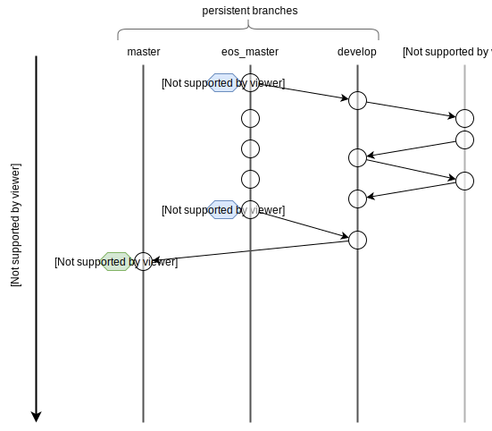

# Haya - blockchain with fast finality based on EOS

Haya implements randpa finality for EOS. Randpa was inspired by grandpa.
We will publish a whitepaper soon.

# Build

```bash
./scripts/eosio_build.sh
```

# Run tests
```bash
./plugins/randpa_plugin/tests/randpa_plugin_unit_test
```

We have also coded our own blockchain simulator for testing. It 
saves us a ton of time when debugging.

Run `randpa_finality.three_nodes` test:

```bash
./simulator/simulator --gtest_filter=randpa_finality.three_nodes
 ```

# Run one node

For the purpose of this tutorial we have provided basic config files in the tutorials/randpa-tutorial/configs 
directory.

Assuming you have your executable in the build directory you can start the node
by running 
 
```bash 

./bin/nodeos --delete-all-blocks -c ../tutorials/randpa-tutorial/configs/config0.ini

...

info  2019-04-24T11:42:24.505 thread-0  producer_plugin.cpp:1597      produce_block        ] Produced block 00000002c38eb2c3... #2 @ 2019-04-24T11:42:24.500 signed by eosio [trxs: 0, lib: 0, confirmed: 0]
info  2019-04-24T11:42:24.509 thread-2  randpa.hpp:585                finish_round         ] Randpa round reached supermajority, round num: 0, best block id: 00000002c38eb2c3cbebceb88129aa6d189c33d1449bb0397e0340cccc81840d, best block num: 2
info  2019-04-24T11:42:25.004 thread-0  producer_plugin.cpp:1597      produce_block        ] Produced block 000000039de520a9... #3 @ 2019-04-24T11:42:25.000 signed by eosio [trxs: 0, lib: 2, confirmed: 0]
info  2019-04-24T11:42:25.504 thread-0  producer_plugin.cpp:1597      produce_block        ] Produced block 000000043a87c431... #4 @ 2019-04-24T11:42:25.500 signed by eosio [trxs: 0, lib: 3, confirmed: 0]
info  2019-04-24T11:42:25.507 thread-2  randpa.hpp:585                finish_round         ] Randpa round reached supermajority, round num: 1, best block id: 000000039de520a9a62390ed3abc545ef3ae80428513fc35ba515edba09acd1c, best block num: 3
info  2019-04-24T11:42:26.004 thread-0  producer_plugin.cpp:1597      produce_block        ] Produced block 0000000590e6067f... #5 @ 2019-04-24T11:42:26.000 signed by eosio [trxs: 0, lib: 4, confirmed: 0]
info  2019-04-24T11:42:26.508 thread-0  producer_plugin.cpp:1597      produce_block        ] Produced block 00000006510daf43... #6 @ 2019-04-24T11:42:26.500 signed by eosio [trxs: 0, lib: 5, confirmed: 0]
info  2019-04-24T11:42:26.511 thread-2  randpa.hpp:585                finish_round         ] Randpa round reached supermajority, round num: 2, best block id: 0000000590e6067f9390cfe2e643de0ffc6dc5094ab750bd5bf1f3b159e62595, best block num: 5
info  2019-04-24T11:42:27.003 thread-0  producer_plugin.cpp:1597      produce_block        ] Produced block 00000007b7dbaaf8... #7 @ 2019-04-24T11:42:27.000 signed by eosio [trxs: 0, lib: 6, confirmed: 0]
info  2019-04-24T11:42:27.506 thread-0  producer_plugin.cpp:1597      produce_block        ] Produced block 00000008e2d399a5... #8 @ 2019-04-24T11:42:27.500 signed by eosio [trxs: 0, lib: 7, confirmed: 0]
info  2019-04-24T11:42:27.508 thread-2  randpa.hpp:585                finish_round         ] Randpa round reached supermajority, round num: 3, best block id: 00000007b7dbaaf833cfa95495192a2dd117fb81428c9ba6e25f141a0cd37e19, best block num: 7
```

If you see "Randpa reached supermajority" messages then you have successfully launched your node.

# Run multiple nodes

Running N nodes is as easy as running one with an additional step 
of setting block producers

1.Run 3 nodes

```bash
./bin/nodeos --delete-all-blocks -c ../tutorials/randpa-tutorial/config0.ini
./bin/nodeos --delete-all-blocks -c ../tutorials/randpa-tutorial/config1.ini
./bin/nodeos --delete-all-blocks -c ../tutorials/randpa-tutorial/config2.ini
```
 
2.Set block producers
```bash
./../tutorials/randpa-tutorial/setup.sh <your-wallet-pass>
```

3.Check for "Randpa reached suppermajority" messages in node logs
  
# Contributing to Haya

Interested in contributing? That's awesome! Please follow our git flow:



